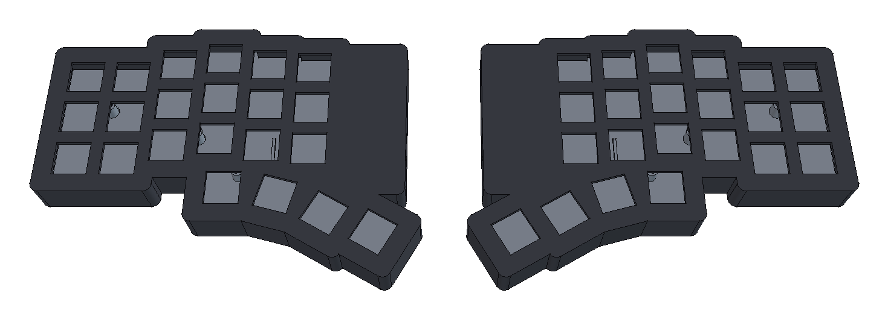

GHKB

<picture>
  <source media="(prefers-color-scheme: dark)" srcset="docs/images/case-preview-dark.png">
  
</picture>

GHKB is an open-source split mechanical keyboard project focused on custom hardware, modern firmware, and long-term experimentation.

The goal of this project is to build a fully custom wireless split keyboard from the ground up, including both the hardware and firmware stack. Rather than assembling an existing design, GHKB documents the complete engineering process—from PCB and enclosure design to firmware development.

Goals

Phase 1: Build a Reliable Daily Driver

Develop a fully functional wireless split keyboard featuring:

* Custom PCB designed with KiCad (single reversible design shared by both halves)
* Custom 3D-printed enclosure
* MX-compatible mechanical switches on hotswap sockets
* Battery-powered operation
* Bluetooth Low Energy (BLE)
* ZMK firmware
* Comfortable ergonomic layout

Controller strategy: the first prototype targets an off-the-shelf nRF52840
controller module (e.g. Nice!Nano) socketed onto the PCB. Designing a fully
custom controller—placing the nRF52840 QFN/BGA package directly on the board—is
a later, optional goal once the socketed design is validated.

Hardware design decisions:

* Layout: 42 keys — a 3x6 column-staggered matrix plus a 3-key thumb cluster
  per half (Corne-style), with an optional EC11 rotary encoder position.
* PCB: one reversible PCB serves both halves (components mount on the front
  for one half and on the back for the other), halving design and
  manufacturing effort.
* Switches: MX hotswap sockets (Kailh), so the prototype can be reworked
  without desoldering.
* Display: none. A display only shows status (battery, layer, BLE profile)
  and is not needed for keyboard operation; omitting it saves cost, battery,
  and three GPIOs kept as spares.
* RGB: deferred past Phase 1. Per-key RGB is battery-hostile on a wireless
  board; at most, unpopulated footprints are reserved.
* Layout generation: switch placement and the board outline are generated
  with ergogen and imported into KiCad, so layout iterations stay
  reproducible.

Phase 2: Develop a TinyGo Firmware

Create a native TinyGo firmware targeting the same hardware platform. The
long-term objective is not simply to recreate existing keyboard firmware, but to
explore whether a modern Go-based embedded ecosystem can become a practical
alternative for custom keyboard development.

Because the wireless BLE stack is by far the highest-risk part of this effort,
Phase 2 is split into two independent milestones:

Phase 2a: USB-wired TinyGo firmware (high feasibility)

Bring up a wired, single-board or wired-split TinyGo build using USB HID, which
is well supported in the TinyGo ecosystem and has existing precedent. This
establishes the matrix scanning, keymap, and feature layer in Go without
depending on wireless.

Phase 2b: BLE-wireless TinyGo firmware (research / uncertain)

Extend the firmware to full wireless operation. This is genuinely exploratory
and may not be achievable: TinyGo's BLE support (`tinygo.org/x/bluetooth`) has
historically centered on the central/scanner role and relies on Nordic's
SoftDevice, whereas a keyboard needs a BLE peripheral with HID-over-GATT,
pairing/bonding, and a wireless split link. ZMK gets these for free from
Zephyr's mature BLE stack; in TinyGo much of it would have to be built from
scratch. Treat Phase 2b as an open question, not a scheduled deliverable.

Planned Features

* Wireless split architecture
* Bluetooth Low Energy (BLE)
* Multi-device pairing
* Battery management
* USB-C charging
* Layer support
* Mod-Tap / Hold-Tap
* Combo keys
* Rotary encoder support
* Optional RGB lighting (post-Phase 1)
* Firmware updates via bootloader

Repository Structure

Note: this is the planned/target layout for the completed project. The
repository currently contains only this README while the project is in the
planning and hardware design phase; directories below are created as work
progresses.

```
.
├── README.md
├── LICENSE
├── .gitignore
├── config/
│   ├── west.yml
│   ├── ghkb.keymap
│   └── boards/shields/ghkb/
├── build.yaml
├── firmware/
│   └── tinygo/
├── pcb/
│   ├── ergogen/
│   │   ├── config.yaml
│   │   └── footprints/
│   ├── keyboard.kicad_pro
│   ├── keyboard.kicad_sch
│   ├── keyboard.kicad_pcb
│   └── libraries/
├── case/
│   ├── source/
│   │   ├── params.py
│   │   ├── layout.py
│   │   ├── ghkb_case.py
│   │   ├── render_preview.py
│   │   ├── left.FCStd
│   │   └── right.FCStd
│   ├── exports/
│   │   ├── left.step / right.step
│   │   └── {left,right}_{top,bottom}.stl
│   └── reference/
│       └── keyboard_pcba.step
├── docs/
│   ├── assembly.md
│   ├── wiring.md
│   └── images/
│       └── case-preview{,-dark}.png
└── bom/
    └── bom.csv
```

Directory Overview

Directory	Description
config	Production ZMK firmware config (west manifest, keymap, custom ghkb shield). Lives at the repo root because ZMK's reusable CI workflow expects config_path/build_matrix_path relative to the west topdir, which must be the repo root - not a nested subdirectory.
firmware/tinygo	Experimental TinyGo firmware implementation.
pcb	KiCad project files, schematics, PCB layout, and custom libraries.
pcb/ergogen	Ergogen layout source (YAML) and reversible footprint library.
case/source	Parametric enclosure build scripts (params/layout/ghkb_case.py) and the generated FreeCAD documents. The switch plate is integrated into the top shell, so there is no separate plate design. Rebuild everything with `freecadcmd case/source/ghkb_case.py`; the build asserts its geometry against the routed PCB and aborts on drift. `render_preview.py` regenerates the README preview images from the built FCStd documents (needs the FreeCAD GUI).
case/exports	Exported manufacturing files (per-half STEP, print-ready top/bottom STLs).
case/reference	kicad-cli STEP export of the routed PCB, used for interference checks.
docs	Assembly guide, wiring documentation, and project images.
bom	Bill of Materials used to build the keyboard.

Roadmap

* Finalize the keyboard layout (42-key, 3x6+3 per half)
* Design the PCB (single reversible board, ergogen + KiCad)
* Design the enclosure (integrated-plate top shell + screwed lid, parametric FreeCAD build; v1 done, pending print validation)
* Build the first prototype
* Bring up ZMK firmware
* Validate the hardware
* Use as a daily driver
* Develop USB-wired TinyGo firmware (Phase 2a)
* Investigate BLE-wireless TinyGo firmware (Phase 2b, research)
* Document the complete development process

Status

This project is currently in the planning and hardware design phase.

Contributing

Contributions are welcome.

Whether you are interested in mechanical keyboards, embedded systems, TinyGo, ZMK, PCB design, or 3D modeling, feel free to open an issue or submit a pull request.

License

This project is licensed under the MIT License. See the LICENSE file for details.
